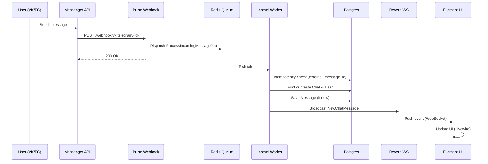

# Pulse — Omnichannel Support Platform

Support platform for multiple channels (Web, VK, Telegram) with department routing, moderator panel (Filament v4), and real-time updates (Laravel Reverb).

## Stack

- **PHP 8.4** — Property hooks, asymmetric visibility, constructor promotion
- **Laravel 12** — Framework
- **PostgreSQL 16+** — Database (jsonb)
- **Redis** — Cache, queue, broadcasting
- **Laravel Reverb** — WebSockets
- **Filament v4** — Admin panel for moderators
- **Spatie Laravel Permission** — Roles: `admin`, `moderator`
- **Laravel Socialite** — VK & Telegram login for moderators
- **DDD** — Domains, Application, Infrastructure, Interfaces

## Requirements

- PHP 8.4 (extensions: pdo_pgsql, redis, intl, zip)
- Composer 2
- Node.js & npm (for frontend)
- PostgreSQL 16+
- Redis (optional for dev; **required for production** — queue, rate limiting, broadcasting)

## Install (local)

```bash
composer install --ignore-platform-req=ext-zip  # if zip ext missing
cp .env.example .env
php artisan key:generate
# Set DB_* (pgsql), REDIS_*, REVERB_* in .env
php artisan migrate
php artisan db:seed
npm install && npm run build
```

## Laragon (Windows)

1. Включите **PostgreSQL** в панели Laragon (порт 5432).
2. **Включите драйвер PHP для PostgreSQL:** правый клик по иконке Laragon → **PHP** → **php.ini**. Найдите строки и уберите точку с запятой в начале (раскомментируйте):
   ```ini
   ;extension=pdo_pgsql   →   extension=pdo_pgsql
   ;extension=pgsql       →   extension=pgsql
   ```
   Сохраните файл и нажмите в Laragon **«Перезагрузить»** (Nginx) или **Stop** → **Start**.
3. Создайте БД (если нет): через «База данных» в Laragon или в **PowerShell**:
   ```powershell
   & "C:\laragon\bin\postgresql\postgresql\bin\psql.exe" -U postgres -c "CREATE DATABASE pulse;"
   ```
   Либо в **cmd**:
   ```cmd
   "C:\laragon\bin\postgresql\postgresql\bin\psql.exe" -U postgres -c "CREATE DATABASE pulse;"
   ```
   (при запросе пароля — в Laragon часто пустой или `postgres`).
4. В проекте уже настроен `.env` под Laragon (pgsql, pulse.test). При необходимости поправьте `DB_USERNAME`/`DB_PASSWORD` под своего пользователя PostgreSQL.
5. Миграции и тестовые данные:
   ```bash
   php artisan migrate --force
   php artisan db:seed --force
   ```

**Тестовые пользователи (после сида):**

| Роль       | Email              | Пароль   |
|-----------|--------------------|----------|
| Админ     | admin@pulse.example | password |
| Модератор | anna@pulse.example  | password |
| Модератор | boris@pulse.example | password |

Админка: **http://pulse.test/admin** — логин любым из этих аккаунтов. Раздел **Chat** — чаты с диалогами для ручной проверки.

## Docker

```bash
docker compose up -d
# App: http://localhost:8080
# Reverb WS: port 8081
```

Services: `app` (PHP-FPM), `nginx`, `postgres`, `redis`, `reverb`. Env is preconfigured in `docker-compose.yml`.

## Environment

See `.env.example`. Main variables:

| Variable | Description |
|----------|-------------|
| `DB_CONNECTION` | `pgsql` (required) |
| `CACHE_STORE` / `QUEUE_CONNECTION` | `redis` recommended |
| `BROADCAST_CONNECTION` | `reverb` |
| `REVERB_*` | Reverb app id/key/secret/host/port |
| `VKONTAKTE_*` | VK OAuth (moderator login) |
| `TELEGRAM_*` | Telegram bot (moderator login) |

## Roles (Spatie)

- **admin** — Full access; can manage roles and users in Filament.
- **moderator** — Access to Filament panel (chats, messages, sources, departments).

Only users with role `admin` or `moderator` can open `/admin`. Assign roles in **Admin → Settings → Users** (or via `php artisan tinker`: `User::find(1)->assignRole('admin')`).

Seed roles: `php artisan db:seed --class=RolesAndPermissionsSeeder`.

## App entry points

| Path | Description |
|------|-------------|
| `/` | Public home |
| `/dashboard` | User dashboard (auth) |
| `/admin` | Filament panel (admin/moderator) |
| `/settings/*` | Profile, password, 2FA |
| `/auth/{provider}/redirect` | Social login redirect (VK, telegram) |
| `/auth/{provider}/callback` | Social login callback |

## Webhooks (inbound)

| Method | Path | Description |
|--------|------|-------------|
| POST | `/webhook/vk/{sourceId}` | VK callback payload |
| POST | `/webhook/telegram/{sourceId}` | Telegram update payload |

`sourceId` is the internal source ID from the `sources` table. Payload is validated by the messenger provider; missing `department_id` falls back to the first department of the source. See [API documentation](docs/api.md) and [OpenAPI 3 spec](docs/openapi.yaml).

## Widget API and embed

Public widget API endpoints:

| Method | Path | Description |
|--------|------|-------------|
| POST | `/api/widget/session` | Create or resume chat session |
| GET | `/api/widget/messages` | Fetch chat messages by `chat_token` |
| POST | `/api/widget/messages` | Send message from site visitor |

Widget script:

```html
<script
  src="https://pulse.example.com/widget/pulse-widget.js"
  data-source="web_site"
  data-api="https://pulse.example.com"
  data-title="Поддержка"
  data-position="right"
></script>
```

`data-source` must match `sources.identifier` for a source with `type=web`.

## Real-time

- Events: `App\Events\NewChatMessage`, `App\Events\ChatAssigned`
- Channels: `private-chat.{chatId}`, `private-moderator.{userId}`
- Authorization: `chat.*` — user must have role admin or moderator; `moderator.*` — own user id

Run Reverb: `php artisan reverb:start`.

**Filament Chat** (`/admin/chat`): Custom page with chat list, message thread, and send form. Uses `wire:poll` (every 3s) to refresh messages when a chat is open. For instant updates, add Laravel Echo in the frontend and listen to `private-chat.{chatId}` for `NewChatMessage`, then trigger a Livewire refresh (e.g. `Livewire.dispatch('refreshMessages')` and a listener on the Chat page).

## Production: queue worker

Incoming webhooks only enqueue a job and respond `200 OK` immediately. You must run a queue worker:

```bash
php artisan queue:work redis --tries=3 --timeout=90
```

Use Redis as `QUEUE_CONNECTION` and `CACHE_STORE` in production so jobs and Telegram rate limiting work correctly.

## Production: Nginx proxy for Reverb (WSS)

Reverb runs on a separate port (e.g. 8081). For HTTPS, proxy WebSockets so clients use `wss://your-domain.com` without opening extra ports:

```nginx
# In your server block, alongside the main app location
location /app/ {
    proxy_pass http://127.0.0.1:8081;
    proxy_http_version 1.1;
    proxy_set_header Upgrade $http_upgrade;
    proxy_set_header Connection "Upgrade";
    proxy_set_header Host $host;
    proxy_set_header X-Real-IP $remote_addr;
    proxy_set_header X-Forwarded-For $proxy_add_x_forwarded_for;
    proxy_set_header X-Forwarded-Proto $scheme;
}
```

Set `REVERB_HOST` and `REVERB_PORT` (and in frontend Echo config) to the same host/port as the main app so connections use `wss://your-domain.com/app/...`.

## Processing flow (inbound message)



## Media (attachments)

VK and Telegram attachment URLs expire. For production, download attachments to your own storage (e.g. S3/MinIO) via a queue job (e.g. `DownloadAttachmentJob`), then store the local URL in the message `payload` instead of the original link. This is not implemented in the core; add it when you need media persistence.

## Project structure (DDD)

```
app/
  Domains/          # Entities, value objects, repository interfaces, messenger interface
  Application/      # Actions, DTOs, use cases
  Infrastructure/   # Eloquent models, repositories, VK/Telegram clients, bindings
  Interfaces/       # (optional) API/UI boundaries
  Filament/         # Filament resources (Sources, Departments, Chats, Messages, Users, Roles)
```

## License

MIT.
